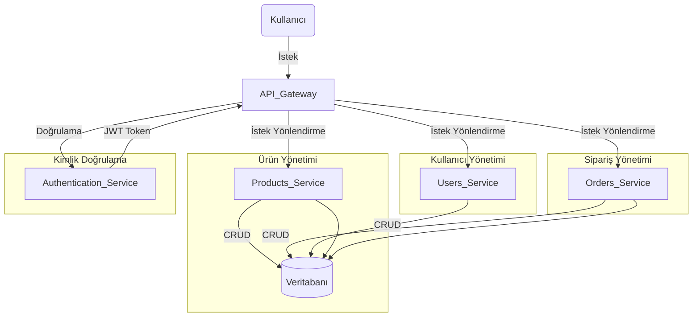
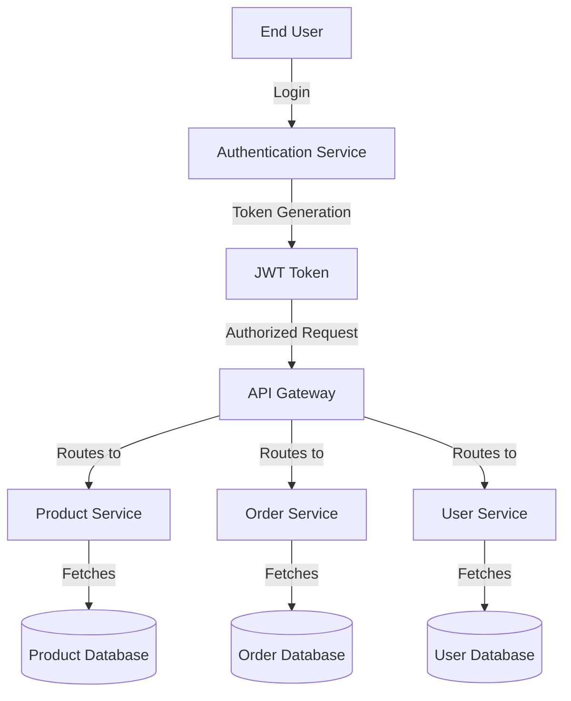
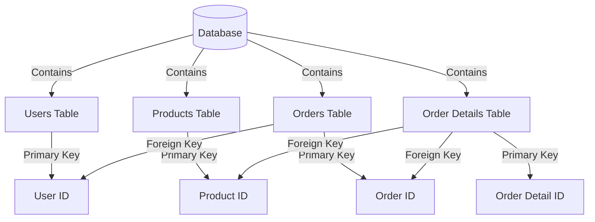
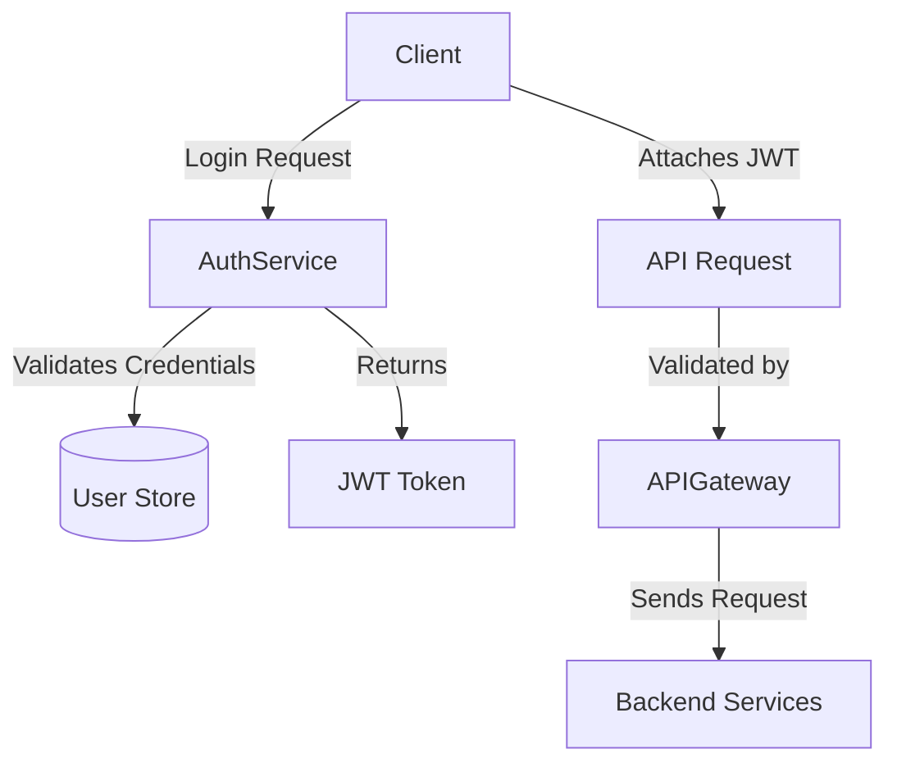
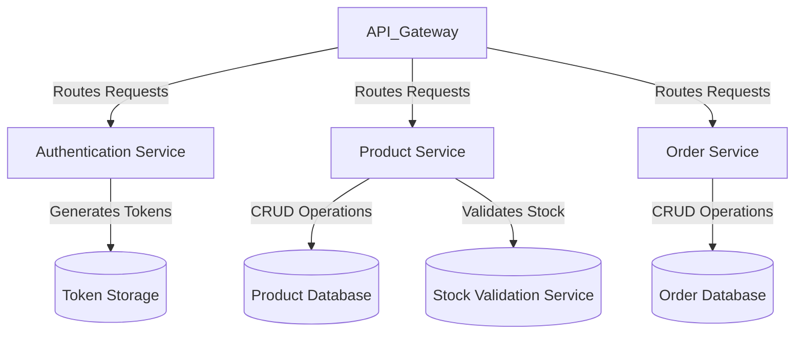

# CoreXCrud Projesi - Kapsamlı API Geliştirme

## 📌 **Proje Açıklaması**

CoreXCrud, **modern, ölçeklenebilir ve güvenli** bir **ASP.NET Core Web API** uygulamasıdır. **CRUD işlemleri**, **JWT Authentication**, **Yetkilendirme**, **Rate Limiting**, **Serilog Loglama**, **Unit of Work & Repository Pattern**, **FluentValidation**, **AutoMapper**, **Mikroservis Mimarisine Uygun Yapı** gibi modern yazılım geliştirme standartlarını içeren kapsamlı bir API geliştirme projesidir.

Bu proje, **kurumsal seviyede API geliştirme süreçlerini** kapsayan **en iyi uygulamaları (best practices)** içermektedir. **Unit Testler ve Entegrasyon Testleri** gibi birçok ileri düzey özellik içermektedir.

----------

## 🚀 **Öne Çıkan Özellikler**

-   ✅ **.NET 8 Web API** kullanılarak geliştirilmiştir.
-   ✅ **JWT Authentication ve Role-based Authorization** desteği.
-   ✅ **AutoMapper ile DTO kullanımı**.
-   ✅ **FluentValidation ile model doğrulama**.
-   ✅ **Serilog ile detaylı loglama (Dosya ve Konsol Destekli).**
-   ✅ **AspNetCoreRateLimit ile Rate Limiting (İstek Sınırlandırma)**.
-   ✅ **Unit of Work & Repository Pattern ile veri yönetimi**.
-   ✅ **Mikroservis mimarisine uygun ölçeklenebilir yapı.**
-   ✅ **Swagger UI ile Test Edilebilir API Geliştirme.**
-   ✅ **RabbitMQ ile Event-Driven Mimarisi.**

----------

## 📁 **Proje Yapısı**

```bash
CoreXCrudSolution/
│── CoreXCrud/                     # Ana API Projesi
│   │── Controllers/               # API Controller dosyaları
│   │── Data/                      # Veritabanı bağlantısı ve DbContext
│   │── DTOs/                      # Veri transfer objeleri (DTO)
│   │── Models/                    # Entity modelleri
│   │── Repositories/              # Repository ve Unit of Work yapısı
│   │── Services/                  # İş mantığı için servis katmanı
│   │── Validators/                # FluentValidation ile model doğrulama
│   │── logs/                      # Serilog log dosyaları
│   │── appsettings.json           # Konfigürasyon ayarları
│── CoreXCrud.UI/                  # Opsiyonel MVC UI Projesi (İptal Edildi)
│── README.md                      # Proje dokümantasyonu

```

----------
## 🎨 **Mimari Diyagram**



## 🗂 **Veri Akışı Diyagramı**



## 📂 **Veritabanı Şema Diyagramı**



## 🔐 **Kimlik Doğrulama Akışı**



## 🏗️ **Hizmet Tabanlı Mimarisi**


----------

## 🏗 **Kurulum ve Çalıştırma**

### **1️⃣ Gerekli Bağımlılıkları Yükleyin**

Öncelikle gerekli NuGet paketlerini yüklemek için aşağıdaki komutu çalıştırın:

```sh
 dotnet restore

```

### **2️⃣ Veritabanını Güncelleyin**

Migration ve veritabanı güncellemesini şu komutlarla yapabilirsiniz:

```sh
 dotnet ef migrations add InitialCreate
 dotnet ef database update

```

### **3️⃣ Uygulamayı Çalıştırın**

Aşağıdaki komutla API’yi çalıştırabilirsiniz:

```sh
 dotnet run

```

Swagger UI’ye erişmek için:

```
https://localhost:7252/swagger

```

----------

## 📊 API Modülleri ve Uç Noktalar

### 🧑‍💼 1️⃣ Kullanıcı Yönetimi (Users)

Kullanıcı yönetimi API'si, sistemdeki kullanıcıları yönetmek için kullanılır.

**HTTP Metodu**

**Uç Nokta**

**Açıklama**

`GET`

`/api/Users`

📌 Tüm kullanıcıları getir

`POST`

`/api/Users`

➕ Yeni kullanıcı oluştur

`GET`

`/api/Users/{id}`

🔍 Belirli bir kullanıcıyı getir

`PUT`

`/api/Users/{id}`

✏️ Kullanıcıyı güncelle

`DELETE`

`/api/Users/{id}`

❌ Kullanıcıyı sil

----------

### 📦 2️⃣ Ürün Yönetimi (Products)

Ürün yönetimi API'si, sistemdeki ürünleri yönetmek için kullanılır.

**HTTP Metodu**

**Uç Nokta**

**Açıklama**

`GET`

`/api/Products`

📌 Tüm ürünleri getir

`POST`

`/api/Products`

➕ Yeni ürün ekle

`GET`

`/api/Products/{id}`

🔍 Belirli bir ürünü getir

`PUT`

`/api/Products/{id}`

✏️ Ürünü güncelle

`DELETE`

`/api/Products/{id}`

❌ Ürünü sil

----------

### 🛒 3️⃣ Sipariş Yönetimi (Orders)

Sipariş yönetimi API'si, müşterilerin siparişlerini yönetmek için kullanılır.

**HTTP Metodu**

**Uç Nokta**

**Açıklama**

`GET`

`/api/Orders`

📌 Tüm siparişleri getir

`POST`

`/api/Orders`

➕ Yeni sipariş oluştur

`GET`

`/api/Orders/{id}`

🔍 Belirli bir siparişi getir

`PUT`

`/api/Orders/{id}`

✏️ Siparişi güncelle

`DELETE`

`/api/Orders/{id}`

❌ Siparişi sil

----------

### 📑 4️⃣ Sipariş Detayları Yönetimi (Order Details)

Sipariş detayları API'si, siparişlerin içeriğini yönetmek için kullanılır.

**HTTP Metodu**

**Uç Nokta**

**Açıklama**

`GET`

`/api/OrderDetails`

📌 Tüm sipariş detaylarını getir

`POST`

`/api/OrderDetails`

➕ Yeni sipariş detayı oluştur

`GET`

`/api/OrderDetails/{id}`

🔍 Belirli bir sipariş detayını getir

`PUT`

`/api/OrderDetails/{id}`

✏️ Sipariş detayını güncelle

`DELETE`

`/api/OrderDetails/{id}`

❌ Sipariş detayını sil

----------

### 🔐 5️⃣ Kimlik Doğrulama (Authentication)

Kimlik doğrulama API'si, kullanıcı giriş işlemleri için kullanılır.

**HTTP Metodu**

**Uç Nokta**

**Açıklama**

`POST`

`/api/Auth/login`

🔐 Kullanıcı girişi yap ve JWT al

#### 📝 Kullanıcı Girişi İçin Örnek JSON İsteği:

```json
{
   "username": "admin",
   "password": "password"
}

```

### 🔑 **Swagger UI'de JWT Authentication Kullanımı**

1.  **Swagger UI'yi açın** (`https://localhost:7252/swagger`).
2.  **Önce `/api/Auth/login` endpointine kullanıcı adı ve şifre ile POST isteği gönderin**.
3.  Dönen **JWT Token'ı kopyalayın**.
4.  Sağ üst köşede bulunan **"Authorize" butonuna** tıklayın.
5.  Açılan pencereye **"Bearer {token}"** formatında JWT'yi yapıştırın.
6.  **Authorize butonuna basarak oturumu açın** ve artık yetkilendirilmiş API çağrıları yapabilirsiniz. 🚀
----------
## 🚨 Hata Durumları ve HTTP Status Kodları

API kullanımı sırasında oluşabilecek hata durumlarını ve döndürülebilecek **HTTP status kodlarını** aşağıda görebilirsiniz.

### 🔴 **Genel Hata Kodları**

**Status Kodu**

**Anlamı**

`400 Bad Request`

❌ Geçersiz veya eksik parametre gönderildi.

`401 Unauthorized`

🔒 Yetkilendirme başarısız oldu veya token eksik.

`403 Forbidden`

🚫 Yetkiniz olmayan bir kaynağa erişmeye çalışıyorsunuz.

`404 Not Found`

🔍 İstenilen kaynak bulunamadı.

`405 Method Not Allowed`

⛔ Geçersiz HTTP metodu kullanıldı.

`409 Conflict`

⚠️ Veri çakışması meydana geldi. (Örn: Kayıt zaten var)

`415 Unsupported Media Type`

📂 Geçersiz içerik türü (Örn: `application/json` beklenirken farklı bir format gönderildi).

`422 Unprocessable Entity`

❌ Doğrulama hatası, girilen veriler uygun değil.

`429 Too Many Requests`

⏳ İstek sınırı aşıldı, çok fazla istek yapıldı.

`500 Internal Server Error`

🔥 Sunucu tarafında beklenmeyen bir hata oluştu.

`503 Service Unavailable`

🚧 Sunucu şu an hizmet veremiyor, daha sonra tekrar deneyin.

### 🔑 **Kimlik Doğrulama ve Yetkilendirme Hataları**

**Status Kodu**

**Anlamı**

`401 Unauthorized`

🔑 JWT token eksik veya geçersiz.

`403 Forbidden`

🔐 Yetkiniz olmayan bir işlemi gerçekleştirmeye çalışıyorsunuz.

`419 Token Expired`

⏳ JWT token süresi dolmuş. Yeni bir token ile giriş yapın.

### 📦 **Ürün Yönetimi Hataları**

**Status Kodu**

**Anlamı**

`404 Not Found`

🛒 Belirtilen ürün bulunamadı.

`400 Bad Request`

❌ Eksik veya hatalı ürün bilgisi gönderildi.

`409 Conflict`

⚠️ Aynı ürün zaten mevcut.

### 🛒 **Sipariş Yönetimi Hataları**

**Status Kodu**

**Anlamı**

`404 Not Found`

📦 Belirtilen sipariş bulunamadı.

`400 Bad Request`

❌ Eksik sipariş bilgisi gönderildi.

`422 Unprocessable Entity`

❌ Sipariş içeriği doğrulama hatası aldı.

### 🛠 **Örnek Hata Yanıtı**

```json
{
   "status": 400,
   "error": "Bad Request",
   "message": "Ürün adı boş olamaz."
}

```
----------

## 📌 **Gelecekteki Geliştirmeler**

1️⃣ **Sipariş Filtreleme ve Raporlama (Tarih, Durum, Kullanıcı Bazlı Raporlar)**  
2️⃣ **Performans Optimizasyonu (Asenkron İşlemler, Caching)**  
3️⃣ **CI/CD Pipeline (GitHub Actions ile Otomatik Deployment)**  
4️⃣ **Event-Driven Mimari için Kafka Desteği** 5️⃣ **Yük Dengeleme için Kubernetes Autoscaling**


----------

## 🎯 **Sonuç**

CoreXCrud, **modern, güvenli ve ölçeklenebilir bir API** olarak geliştirilmiştir. **.NET 8**, **JWT Authentication**, **FluentValidation**, **Serilog**, **AutoMapper** gibi en güncel teknolojilerle desteklenmiştir.

🚀 **Her şey başarıyla tamamlandı, şimdi projenizi kullanmaya başlayabilirsiniz!** 🔥

## Lisans

Bu proje [MIT Lisansı](LICENSE) kapsamında kullanıma sunulmuştur.
